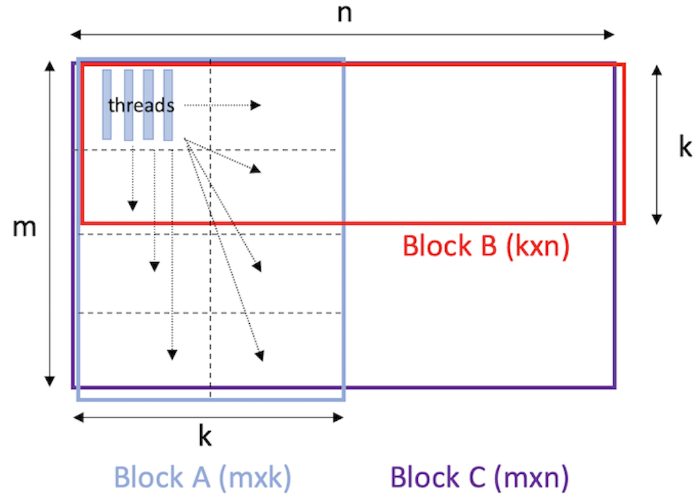

# dgemm-gpu

This is an implementation of matrix multiplication on GPU, optimized with matrix tiling, shared memory and ILP.

<p align="center">

</p>

To compile and run the program,
```bash
# bx, by: block size
# shmk: dimension of shared memory => (bx, shmk), (shmk, by)
# noutm: number of ILP outputs along vertical axis
# noutn: number of ILP outputs along horizontal axis
# noutk: number of partitions along shmk

make clean
make bx=<...> by=<...> shmk=<...> noutm=<...> noutn=<...> noutk=<...>

sh run.sh
```

Below is the performance with default macros defined in Makefile. Over 700Gflop/s can be achieved on large N by setting (bx=96, by=96 shmk=32, noutm=6, noutn=6, noutk=2).


| Input dimension | Gflop/s |
| --------------- | ------- |
| 256             | 411.9   |
| 512             | 705.8   |
| 1024            | 670     |
| 2048            | 667.9   |